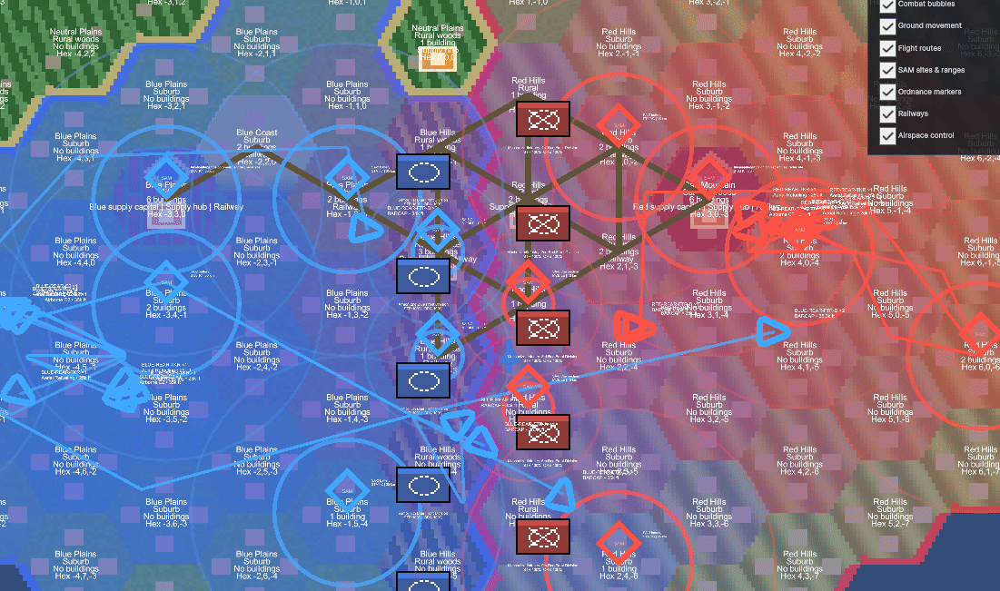
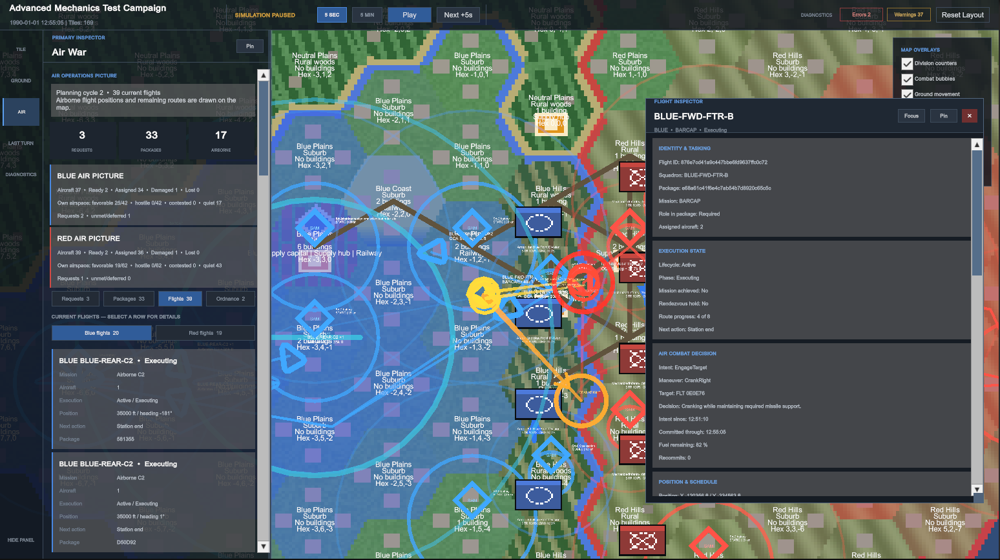
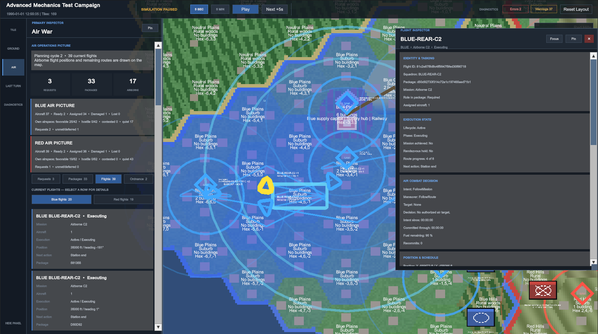

# HZPL Engine

HZPL Engine is a Unity-based dynamic campaign engine focused on modern air
warfare. It runs an autonomous conflict across an operational hex map, combining
air tasking, flight execution, integrated air defenses, ground operations, and
logistics in one simulation environment.




> [!IMPORTANT]
> HZPL Engine is under active development. The current version is a standalone
> simulation and diagnostic workbench, not yet a complete player-facing game or
> an integration with a third-party flight simulator.

## Overview

HZPL Engine is intended to model a living, unscripted war in which both sides
plan and execute operations without requiring player input. Air warfare receives
the highest simulation detail, while the operational ground war creates the
front lines, objectives, logistics, and consequences that give those air
operations meaning.

The project separates its simulation rules from simulator-specific content:

- The **core engine** resolves air operations, IADS behavior, combat, ground
  operations, supply, and time progression.
- A **Module** supplies maps, countries, unit definitions, and an adapter for a
  particular third-party simulator.
- The current **Standalone Module** exercises the complete campaign workflow
  with test content and a no-op simulator adapter.
- The **DCS Prototype Module** binds a Caucasus test campaign to DCS identifiers
  and can export a paused, AI-only observation mission.

This structure is designed to allow future integrations to replace content and
translation layers without rewriting the campaign simulation itself.

## Current capabilities

- Campaign simulation with AI-controlled ground factions and scripted air plans
- Configurable campaign time with five-second tactical checkpoints
- Deterministic authored air-package plans for focused mission development
- Barrier combat air patrols, offensive counter-air sweeps, airborne C2,
  aerial refueling, strike, fighter escort, and SEAD escort task types
- Package construction, aircraft reservation, loadout planning, routing, and
  flight lifecycle management
- Chronological beyond-visual-range air combat with persistent delayed ordnance
  effects
- Integrated air-defense networks with radar tracking, engagement assignment,
  remote cueing, and SAM execution
- Operational ground tasking, movement, combat, retreat, and territory capture
- Supply networks, hubs, capitals, and infrastructure-aware strategic value
- An interactive campaign workbench for inspecting tiles, units, flights,
  packages, combat, ordnance, and diagnostics

The current player role is an **autonomous observer**: both factions run through
the same campaign systems while the workbench exposes their plans, execution,
and outcomes for inspection.

## Getting started

### Requirements

- [Unity Hub](https://unity.com/download)
- Unity Editor **6000.3.15f1**
- Git, or a downloaded copy of this repository

No third-party flight simulator is required for the current Standalone Module.

### Run the campaign workbench

1. Clone the repository:

   ```powershell
   git clone https://github.com/jfouts2010/HZPLEngine.git
   ```

2. In Unity Hub, select **Add project from disk** and choose the cloned
   `HZPLEngine` directory.
3. Allow Unity to restore packages and finish importing the project.
4. Open `Assets/Scenes/PlayScene.unity`.
5. Enter Play Mode. The Advanced test campaign loads automatically in a paused
   state.
6. Select **Play** to run continuously, or **Next +5s** to advance one playback
   increment at a time.

> [!NOTE]
> Open `PlayScene.unity` directly. `SampleScene.unity` is the default Unity
> template scene and does not contain the campaign workbench.

## Workbench controls

| Action | Control |
| --- | --- |
| Run or pause the campaign | **Play/Pause** in the top bar |
| Select playback speed | **5 SEC** or **5 MIN** |
| Advance while paused | **Next +5s** or **Next +5m**, depending on the selected increment |
| Inspect the campaign | Use the **Tile**, **Ground**, **Air**, **Last Turn**, and **Diagnostics** tabs |
| Export a DCS AI observation mission | While paused in the DCS Prototype Module, open **Air** and select **Export current air picture (.miz)** |
| Toggle map information | Use the overlay palette for units, combat, movement, routes, BARCAP and territory boundaries, SAM coverage, ordnance, and railways |
| Pan the map | <kbd>W</kbd><kbd>A</kbd><kbd>S</kbd><kbd>D</kbd>, arrow keys, middle-mouse drag, or right-mouse drag |
| Zoom the map | Mouse wheel while the pointer is over the map |
| Restore the interface | **Reset Layout** |

## Inspecting air operations

The Air workbench exposes authored package plans, current packages,
flights, aircraft availability, airspace picture, and recent ordnance activity.
Selecting a flight opens its tasking, route, execution state, combat decision,
loadout, and event history.



Airborne C2, tanker, patrol, and sweep coverage can be inspected directly on the
map alongside routes and air-defense coverage.



## Architecture

| Area | Responsibility |
| --- | --- |
| Core models | Campaign templates, runtime state, module catalogs, and shared domain types |
| Air tasking | Mission demand, priority, packages, support allocation, and aircraft reservation |
| Air execution | Flight schedules, routes, tactical decisions, combat, and recovery |
| IADS | Radar tracks, network coordination, engagement assignment, and SAM launches |
| Ground war | AI orders, pathfinding, movement, tactical combat, retreat, and capture |
| Supply | Network connectivity, hub distribution, formation supply, and strategic value |
| Workbench | Map rendering, simulation controls, overlays, inspectors, and diagnostics |
| Sim adapter | Future scenario export and mission-result import for a specific simulator |

The simulation aims to remain deterministic and explainable. Significant rules
and irreversible technical choices are recorded as architecture decision records
under [`docs/adr`](docs/adr).

## Project direction

The current focus is making the Standalone Module produce a believable,
observable air-and-ground war over long simulation runs. Near-term work deepens
air tasking, combat, IADS behavior, air-to-ground effects, campaign authoring,
and persistence.

Longer-term goals include:

- Simulator-specific Modules and content catalogs
- Exporting a playable sortie to a third-party flight simulator
- Importing losses, damage, and mission outcomes into the running campaign
- Player command and pilot-intervention modes built on the same autonomous core
- Fog-of-war and intelligence rules behind the existing planning boundary

Detailed ground warfare is intentionally secondary to the operational layer
needed to support the air campaign.

## Documentation

- [`VISION.md`](VISION.md) describes the target product, scope, and development
  phases.
- [`CONTEXT.md`](CONTEXT.md) defines the project's canonical domain vocabulary.
- [`docs/adr`](docs/adr) records important architectural decisions and their
  trade-offs.
- [`docs/dcs-ai-observation-export.md`](docs/dcs-ai-observation-export.md)
  describes the DCS prototype export and its in-simulator test checklist.

Contributors should read those documents before changing core rules or
introducing new domain terminology.

## Current limitations

- The DCS export is a Caucasus-only, AI-observation prototype with a limited
  aircraft, weapon, airport, and SAM catalog.
- DCS mission-result import and player intervention are not implemented.
- Campaign play is observer-focused; player command is future work.
- Close-range air combat beyond the current BVR-to-merge boundary is deferred.
- The UI is a development and diagnostic workbench rather than a finished game
  interface.

## License

HZPL Engine is licensed under the [Apache License 2.0](LICENSE).
